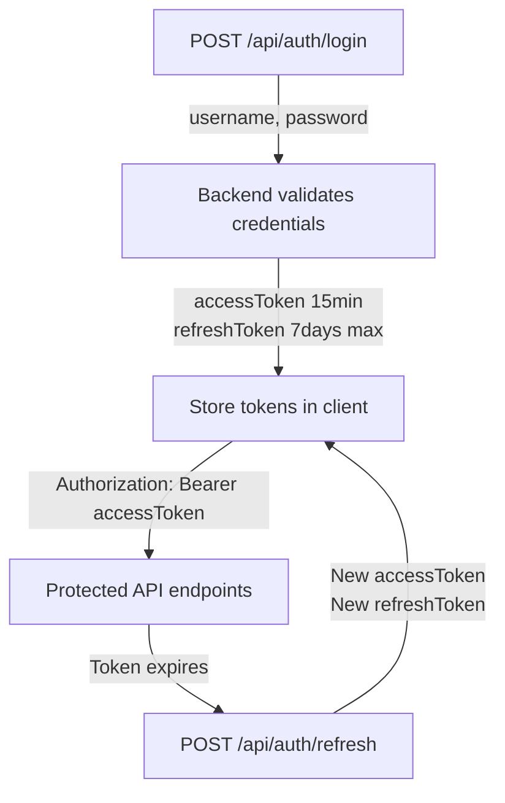

# API Documentation

## Overview

The BetterLibmanan REST API provides programmatic access to all platform features. The API follows RESTful conventions, uses JSON for request and response payloads, and implements JWT-based authentication for protected endpoints.

**Base URL (Development)**: `http://localhost:5000/api`
**Base URL (Production)**: `https://your-domain.com/api`

## Table of Contents

- [Authentication](./authentication.md) -- Login, token refresh, logout
- [Endpoints Reference](./endpoints.md) -- Complete API endpoint listing
- [Error Handling](./errors.md) -- Error codes and response formats

## Quick Start

### 1. Health Check

Verify the server is reachable:

```bash
curl http://localhost:5000/health
```

Response:

```json
{
  "success": true,
  "message": "Server is healthy",
  "timestamp": "2026-07-27T12:00:00.000Z",
  "environment": "development",
  "server": {
    "uptime": 1234.56,
    "memory": {},
    "version": "v18.0.0"
  },
  "frontend": {
    "distPath": "/path/to/build/frontend",
    "indexHtml": true,
    "assetsDir": true,
    "ready": true
  }
}
```

### 2. API Root

Confirm the API is available:

```bash
curl http://localhost:5000/api
```

Response:

```json
{ "success": true, "message": "API ready", "version": "1.0.0" }
```

### 3. Admin Login

```bash
curl -X POST http://localhost:5000/api/auth/login \
  -H "Content-Type: application/json" \
  -d '{ "username": "admin", "password": "yourpassword" }'
```

Response:

```json
{
  "success": true,
  "message": "Login successful",
  "data": {
    "accessToken": "eyJhbGciOiJIUzI1NiIsInR5cCI6IkpXVCJ9...",
    "refreshToken": "eyJhbGciOiJIUzI1NiIsInR5cCI6IkpXVCJ9...",
    "admin": {
      "_id": "507f1f77bcf86cd799439011",
      "username": "admin",
      "displayName": "Administrator",
      "email": "admin@example.com",
      "role": "superadmin"
    }
  }
}
```

### 4. Authenticated Request

Include the access token in the `Authorization` header:

```bash
curl http://localhost:5000/api/auth/me \
  -H "Authorization: Bearer <access-token>"
```

## Authentication Flow



See [Authentication](./authentication.md) for full details.

## Standard Response Format

### Success

```json
{
  "success": true,
  "message": "Operation successful",
  "data": {}
}
```

### Error

```json
{
  "success": false,
  "message": "Error description",
  "errors": ["Detailed error 1", "Detailed error 2"]
}
```

See [Error Handling](./errors.md) for the complete error reference.

## API Modules

| Module             | Base Path                     | Description                                 |
| ------------------ | ----------------------------- | ------------------------------------------- |
| Auth               | `/api/auth/*`                 | Admin authentication and session management |
| Accounts           | `/api/accounts/*`             | Admin account management (superadmin only)  |
| Audit              | `/api/audit/*`                | Audit log queries (superadmin only)         |
| Users              | `/api/users/*`                | Public user registration and profiles       |
| Services           | `/api/services/*`             | Government services catalog                 |
| Tourism            | `/api/tourism/*`              | Tourism attractions                         |
| Leadership         | `/api/leadership/*`           | Government officials                        |
| Legislative        | `/api/legislative/*`          | Ordinances and resolutions                  |
| Transparency       | `/api/transparency/*`         | LGU transparency records                    |
| Statistics         | `/api/statistics/*`           | Municipal statistics and demographics       |
| Freedom Wall       | `/api/freedom-wall/*`         | Anonymous community posts                   |
| Community          | `/api/community/*`            | Discussions and events                      |
| Contact            | `/api/contact/*`              | Contact information and forms               |
| Emergency Contacts | `/api/emergency-contacts/*`   | Emergency hotlines                          |
| Medical Contacts   | `/api/medical-contacts/*`     | Hospitals and health facilities             |
| Office Directory   | `/api/office-directory/*`     | Municipal office directory                  |
| Popular Services   | `/api/popular-services/*`     | Featured services on homepage               |
| At a Glance        | `/api/at-a-glance/*`          | Homepage statistics                         |
| History            | `/api/history/*`              | Municipal history milestones                |
| Latest Updates     | `/api/latest-updates/*`       | News and announcements                      |
| Marquee Images     | `/api/marquee-images/*`       | Homepage carousel images                    |
| Municipal Hall     | `/api/municipal-hall/*`       | Municipal hall information                  |
| Barangay Map       | `/api/barangay-map/*`         | Barangay map data                           |
| Better LUGs        | `/api/better-lugs/*`          | Other LGU platforms directory               |
| Quiz               | `/api/quiz/*`                 | Civic quizzes                               |
| Social Links       | `/api/social-links/*`         | Social media links                          |
| Files              | `/api/properties/image-proxy` | Image proxy for R2 assets                   |

## Common Query Parameters

Most list endpoints support the following parameters:

| Parameter | Type            | Default     | Description             |
| --------- | --------------- | ----------- | ----------------------- |
| `page`    | number          | `1`         | Page number (1-indexed) |
| `limit`   | number          | `10`        | Items per page          |
| `sort`    | string          | `createdAt` | Sort field              |
| `order`   | `asc` or `desc` | `desc`      | Sort direction          |
| `search`  | string          | --          | Text search query       |

Example:

```
GET /api/tourism?page=2&limit=20&sort=name&order=asc&search=beach
```

## Rate Limits

| Endpoint                 | Limit                            | Window     |
| ------------------------ | -------------------------------- | ---------- |
| `POST /api/auth/login`   | 10 requests                      | 15 minutes |
| `POST /api/auth/refresh` | 30 requests                      | 15 minutes |
| All other endpoints      | 500 requests (prod) / 1000 (dev) | 15 minutes |

Exceeded limits return `429 Too Many Requests`.

## Versioning

The current API version is **1.0.0** and is not encoded in the URL path. Breaking changes will be communicated via major version bumps and deprecation notices.
