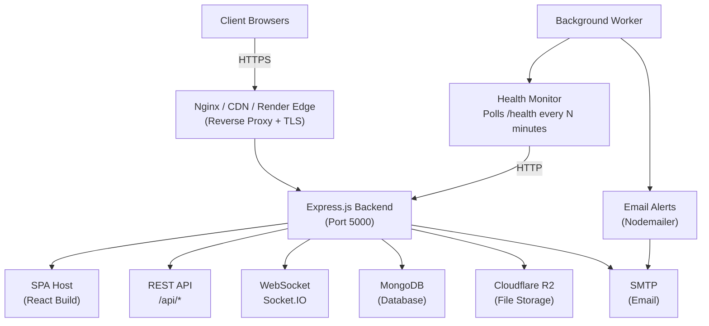

# Architecture Documentation

## Overview

BetterLibmanan is an enterprise-grade Local Government Unit (LGU) platform designed as a monorepo. It combines a React SPA frontend, an Express.js backend, and a background worker process. The system serves as the digital portal and operations hub for the Municipality of Libmanan.

## Table of Contents

- [System Overview](./overview.md)
- [Security Model](./security.md)

## High-Level Architecture



## Monorepo Structure

The project uses Turborepo for build orchestration and pnpm workspaces for package management.

```
betterlibmanan/
+-- apps/
|   +-- frontend/          # React + Vite SPA (port 3000 in dev)
|   +-- backend/           # Express.js API (port 5000)
|   +-- worker/            # Background job processor
+-- packages/
|   +-- types/             # Shared TypeScript type definitions
|   +-- utils/             # Shared utility functions
|   +-- ui-kit/            # Reusable UI component library
|   +-- sdk/               # API client SDK for frontend
|   +-- eslint-config/     # Shared ESLint configuration
|   +-- tsconfig/          # Shared TypeScript configurations
+-- infrastructure/
|   +-- docker/            # Dockerfiles and docker-compose
|   +-- kubernetes/        # K8s manifests
|   +-- terraform/         # Infrastructure as Code
|   +-- ansible/           # Configuration management playbooks
|   +-- monitoring/        # Prometheus, Grafana, Loki configs
|   +-- nginx/             # Nginx configuration
+-- docs/                  # This documentation
+-- tools/                 # Code generators and automation scripts
+-- scripts/               # Development and build helper scripts
```

## Core Design Principles

### 1. Single-Origin Deployment

In production, the Express backend serves both the React SPA and the API from a single port (5000). This eliminates CORS complexity in production and simplifies deployment.

```
http://yourhost:5000/          -> SPA (React build)
http://yourhost:5000/api/*     -> REST API
http://yourhost:5000/socket.io -> WebSocket
http://yourhost:5000/health    -> Health check
```

### 2. Domain-Driven Modules

The backend is organized by feature modules, each self-contained with its own model, service, controller, and routes. This avoids cross-cutting concerns and makes features independently maintainable.

### 3. Shared Package Strategy

Common code (TypeScript types, utilities, UI components) lives in the `packages/` directory and is consumed as workspace dependencies (`workspace:*`). This ensures type safety and consistency without code duplication.

### 4. Infrastructure as Code

All infrastructure is defined as code (Docker, Kubernetes, Terraform, Ansible), enabling reproducible deployments across environments.

## Technology Stack Summary

| Layer         | Technology                        | Purpose                                  |
| ------------- | --------------------------------- | ---------------------------------------- |
| Frontend      | React 18, TypeScript, Vite        | UI rendering and user interaction        |
| Styling       | Tailwind CSS, Framer Motion       | Design system and animations             |
| State         | Zustand, React Query (v5)         | Client state and server data caching     |
| Backend       | Express.js 4, TypeScript          | REST API and SPA serving                 |
| Database      | MongoDB 7 (Mongoose 8)            | Primary data store                       |
| Cache/Queue   | Redis 7                           | Caching, session store, job queues       |
| Auth          | JWT (jsonwebtoken)                | Access tokens and refresh token rotation |
| Storage       | Cloudflare R2 (AWS S3-compatible) | File and image storage                   |
| Real-time     | Socket.IO 4                       | WebSocket connections                    |
| Email         | Nodemailer                        | Transactional emails and alerts          |
| Logging       | Winston                           | Structured JSON logging                  |
| Validation    | Zod                               | Runtime type validation                  |
| Build         | Turborepo, tsc, Vite              | Build orchestration                      |
| Containers    | Docker, Docker Compose            | Local and production containers          |
| Orchestration | Kubernetes                        | Production-grade orchestration           |
| IaC           | Terraform                         | Cloud infrastructure provisioning        |
| Config Mgmt   | Ansible                           | Server configuration automation          |
| Monitoring    | Prometheus, Grafana, Loki         | Metrics, dashboards, log aggregation     |

## Related Documents

- [System Overview](./overview.md) -- detailed component walkthrough
- [Security Model](./security.md) -- authentication, authorization, and security controls
