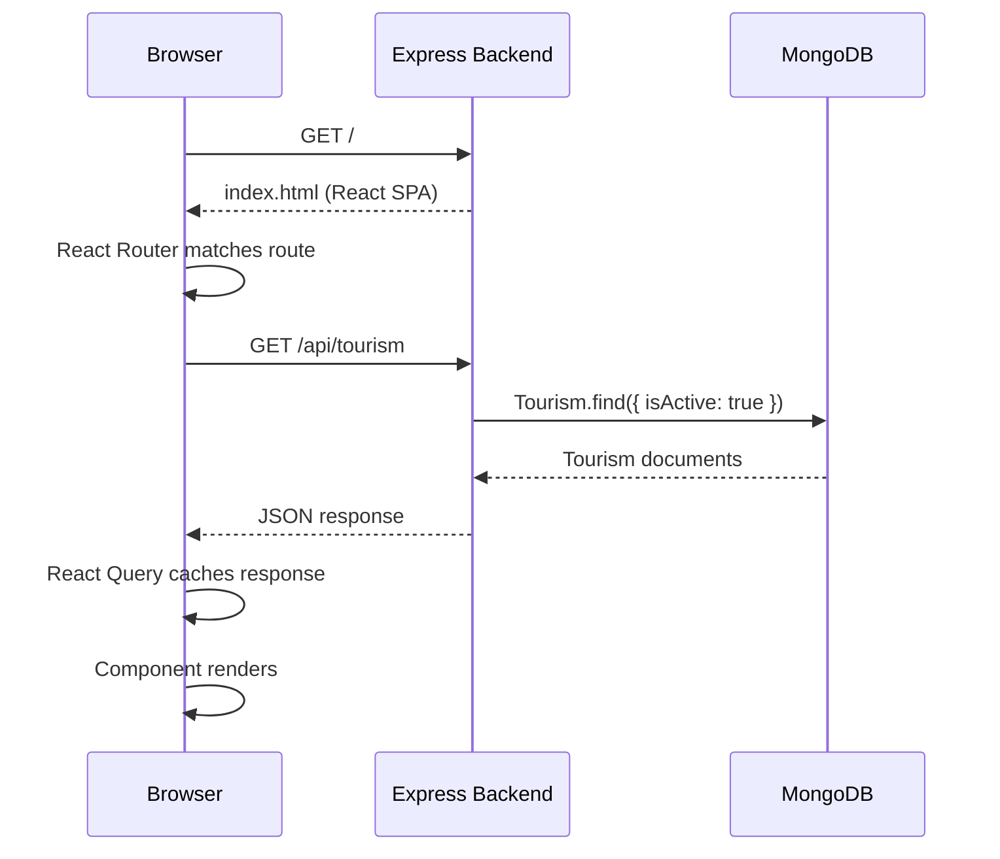
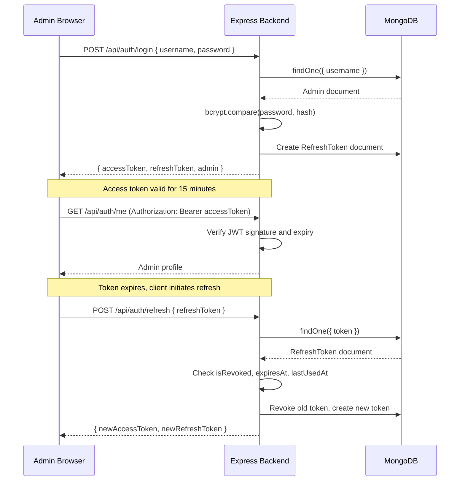
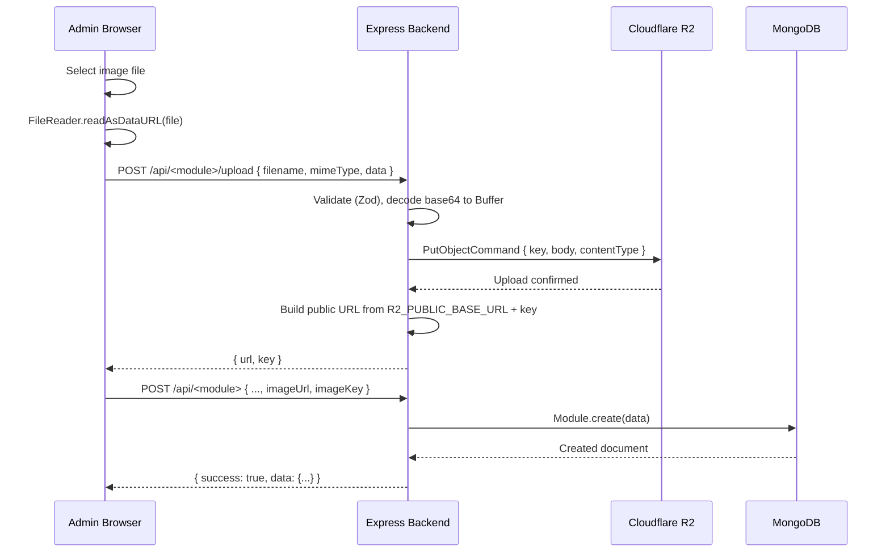

# System Overview

## Introduction

BetterLibmanan is a full-stack web application designed to serve as the primary digital platform for the Municipality of Libmanan. It provides residents with access to government services, information, and real-time updates, while giving government officials administrative control over content and user management.

## System Components

### 1. Frontend Application (`apps/frontend`)

**Technology**: React 18, TypeScript, Vite, Tailwind CSS

The frontend is a modern Single Page Application (SPA) divided into two functional areas:

**Public Portal** -- accessible to all visitors without authentication:

- Landing page with hero sections and marquee carousel
- Government information: history, leadership, departments
- Services catalog and life event guides
- Tourism attractions and local information
- Legislative documents: ordinances and resolutions
- Transparency reports and statistics
- Contact information and emergency hotlines
- Freedom Wall: anonymous community posts
- Interactive barangay map

**Admin Dashboard** -- protected routes for authenticated administrators:

- Content management for all platform modules
- User and account management
- Audit log viewer
- Real-time analytics
- File uploads and asset management
- Admin registration approval workflow

Key capabilities:

- Responsive, mobile-first layout
- Multilingual support (English, Filipino)
- WCAG 2.1 accessibility compliance
- Code-split for optimized performance
- Real-time updates via WebSocket
- Progressive Web App (PWA) with service worker support

### 2. Backend Application (`apps/backend`)

**Technology**: Express.js, TypeScript, MongoDB, Socket.IO

The backend serves as both an API server and the SPA host in production. It exposes:

- **REST API** (`/api/*`): CRUD operations for all modules
- **WebSocket Server** (`/socket.io`): Real-time bidirectional communication
- **Static File Serving**: Delivers the compiled React SPA build
- **Health Endpoint** (`/health`): System status and diagnostics
- **Image Proxy** (`/api/properties/image-proxy`): Proxies R2 assets with DNS override

#### Backend Source Structure

```
apps/backend/src/
+-- bootstrap/
|   +-- app.ts             # Express app setup and global middleware
|   +-- routes.ts          # Central API router, mounts all module routers
|   +-- server.ts          # HTTP server wrapper
+-- gateway/
|   +-- websocket/         # Socket.IO initialization and event handlers
|   +-- http/              # (planned) HTTP gateway
|   +-- rest/              # (planned) REST gateway
|   +-- graphql/           # (planned) GraphQL gateway
|   +-- rpc/               # (planned) RPC gateway
+-- modules/               # 30+ domain feature modules
|   +-- auth/              # JWT auth, token rotation, sessions
|   +-- accounts/          # Admin account management
|   +-- audit/             # Action logging
|   +-- tourism/           # Tourism listings
|   +-- leadership/        # Officials directory
|   +-- legislative/       # Ordinances and resolutions
|   +-- transparency/      # LGU project transparency
|   +-- services/          # Government services catalog
|   +-- statistics/        # Municipal statistics
|   +-- freedom-wall/      # Community posts
|   +-- community/         # Discussions
|   +-- ...
+-- infrastructure/
|   +-- database.ts        # MongoDB connection
|   +-- storage/           # Cloudflare R2 upload helpers
|   +-- messaging/         # Email via Nodemailer
|   +-- external-services/ # Third-party API clients
+-- shared/
    +-- config/            # Environment variable configuration
    +-- logger/            # Winston logger
    +-- middleware/        # Error handler, request logger, auth guards
    +-- storage/           # R2 upload helpers (re-export)
    +-- mailer/            # Email templates and sending
    +-- utils/             # Common utility functions
```

Each module follows a consistent file structure:

```
modules/<name>/
+-- <name>.model.ts        # Mongoose schema and TypeScript interface
+-- <name>.service.ts      # Business logic (no HTTP concerns)
+-- <name>.controller.ts   # Request handlers
+-- <name>.routes.ts       # Express router
+-- <name>.middleware.ts   # Module-specific middleware
+-- index.ts               # Module exports
```

### 3. Worker Application (`apps/worker`)

**Technology**: Node.js, TypeScript, Axios, Nodemailer

The worker is a lightweight background process that runs independently from the backend. Current responsibilities:

- **Health Monitoring**: Polls the backend `/health` endpoint at a configurable interval
- **Email Alerting**: Sends email notifications when health checks fail
- **Alert Deduplication**: Suppresses repeat alerts until the service recovers

Future capabilities (scaffolded):

- Job queue processing
- Scheduled background tasks
- Data synchronization
- Batch report generation

### 4. Shared Packages (`packages/`)

| Package                         | Purpose                            | Consumers                 |
| ------------------------------- | ---------------------------------- | ------------------------- |
| `@betterlibmanan/types`         | Shared TypeScript type definitions | Frontend, Backend, Worker |
| `@betterlibmanan/utils`         | Common utility functions           | Frontend, Backend, Worker |
| `@betterlibmanan/ui-kit`        | Reusable React components          | Frontend                  |
| `@betterlibmanan/sdk`           | Type-safe API client               | Frontend                  |
| `@betterlibmanan/eslint-config` | Shared ESLint configuration        | All packages              |
| `@betterlibmanan/tsconfig`      | Shared TypeScript configurations   | All packages              |

## Data Flows

### Public User Journey



### Admin Authentication Flow



### File Upload Flow (Cloudflare R2)



## Environment Configuration

The system is configured entirely through environment variables. See [`.env.example`](../../.env.example) for a complete reference.

### Critical Variables

| Variable               | Purpose                       |
| ---------------------- | ----------------------------- |
| `MONGODB_URI`          | Database connection string    |
| `JWT_ACCESS_SECRET`    | Access token signing secret   |
| `JWT_REFRESH_SECRET`   | Refresh token signing secret  |
| `R2_ACCOUNT_ID`        | Cloudflare account identifier |
| `R2_ACCESS_KEY_ID`     | R2 access key                 |
| `R2_SECRET_ACCESS_KEY` | R2 secret key                 |
| `SMTP_HOST`            | Email server hostname         |
| `ADMIN_EMAIL`          | Alert notification recipient  |

## Deployment Modes

### Development

```bash
pnpm install
pnpm run dev
```

- Frontend on `http://localhost:3000` (Vite dev server with HMR)
- Backend on `http://localhost:5000` (tsx watch)
- Worker runs independently
- CORS permits `localhost:3000`

### Production (Single Origin)

```bash
pnpm run build
pnpm run start
```

- Frontend compiled to `build/frontend/`
- Backend serves SPA from `/` and API from `/api/*`
- All traffic on port 5000
- No CORS required (same origin)
- Static assets served with long-lived cache headers

## Monitoring and Observability

### Logging

- Winston structured JSON logs
- Log levels: `error`, `warn`, `info`, `debug`
- Log aggregation via Loki (`infrastructure/monitoring/loki`)

### Metrics

- Prometheus scrapes the `/metrics` endpoint
- Grafana dashboards for visualization
- Tracked: request rate, error rate, latency, database connections

### Health Checks

- Endpoint: `GET /health`
- Reports: database connectivity, memory usage, server uptime
- Worker polls health endpoint and sends email alerts on failure

## Related Documents

- [Security Model](./security.md)
- [Architecture Decision Records](../decisions/)
- [System Diagrams](../diagrams/)
