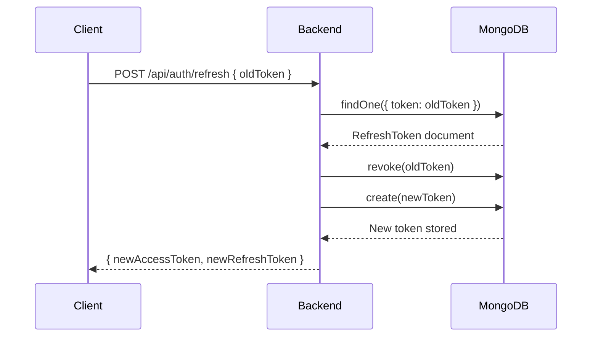

# Security Model

## Overview

BetterLibmanan implements a multi-layered security model covering authentication, authorization, input validation, data protection, and operational security.

## Authentication

### JWT Token Architecture

The system uses a two-token strategy:

| Token Type    | TTL            | Storage                 | Purpose                            |
| ------------- | -------------- | ----------------------- | ---------------------------------- |
| Access Token  | 15 minutes     | Memory / localStorage   | Authorizes individual API requests |
| Refresh Token | 7 days maximum | localStorage / database | Obtains new access tokens          |

Access Token Claims:

```json
{
  "sub": "<admin-id>",
  "username": "admin",
  "displayName": "Administrator",
  "role": "superadmin",
  "type": "access",
  "iat": 1720000000,
  "exp": 1720000900
}
```

### Refresh Token Rotation

Every call to `POST /api/auth/refresh` invalidates the old token and issues a new pair. This limits the window of exposure if a token is compromised.



### Session Inactivity Timeout

Sessions expire after 30 minutes of inactivity (configurable via `SESSION_INACTIVITY_TIMEOUT_MINUTES`). The backend tracks the `lastUsedAt` timestamp on each refresh token document. If a refresh is attempted after the inactivity window, it is rejected with code `INACTIVITY_TIMEOUT`.

Active users are never affected because the frontend calls `/refresh` on user activity.

### Token Reuse Detection

If a revoked refresh token is submitted:

1. All refresh tokens for that admin are immediately revoked (full session wipe)
2. A warning entry is written to the server log
3. The request is rejected with `401`

This protects against token theft and replay attacks.

### JWT Secret Hardening

In production (`NODE_ENV=production`), the server throws on startup if default or placeholder JWT secrets are detected. This prevents accidental deployment with insecure secrets.

## Authorization

### Admin Roles

| Role         | Capabilities                                                   |
| ------------ | -------------------------------------------------------------- |
| `superadmin` | Full access to all modules, accounts, audit logs, and settings |
| `admin`      | Content management for assigned modules                        |
| `moderator`  | Moderation of user-generated content (Freedom Wall, Community) |

### Middleware Guards

```typescript
import { requireAuth } from "@/modules/auth/auth.middleware";

router.get("/protected", requireAuth, handler);
```

The `requireAuth` middleware:

1. Reads the `Authorization: Bearer <token>` header
2. Verifies the JWT signature and expiry
3. Attaches the decoded `AdminPayload` to `req.admin`
4. Returns `401` if the token is missing or invalid

### Audit Logging

All administrative actions are recorded in the `auditlogs` MongoDB collection:

```typescript
writeAuditLog(
  { admin: req.admin, ipAddress, userAgent },
  { action: "UPDATE", module: "Leadership", resourceId, description },
);
```

Tracked actions: `LOGIN`, `LOGOUT`, `LOGOUT_ALL`, `CREATE`, `UPDATE`, `DELETE`.

## Input Validation

### Zod Schema Validation

All API request bodies are validated with Zod schemas before processing:

```typescript
const loginSchema = z.object({
  username: z.string().min(1).max(32),
  password: z.string().min(1).max(128),
});

const parsed = loginSchema.safeParse(req.body);
if (!parsed.success) {
  // Return structured validation errors
}
```

### Body Size Limits

Express is configured with the following payload limits:

- JSON body: 10 MB
- URL-encoded body: 10 MB

### Rate Limiting

| Endpoint                 | Limit                           | Behavior                    |
| ------------------------ | ------------------------------- | --------------------------- |
| `POST /api/auth/login`   | 10 req / 15 min                 | Counts failed attempts only |
| `POST /api/auth/refresh` | 30 req / 15 min                 | Counts all attempts         |
| All other endpoints      | 500 req / 15 min (production)   | Global IP-based limiter     |
| All other endpoints      | 1000 req / 15 min (development) | Global IP-based limiter     |

## Security Headers

The backend uses Helmet.js to set the following headers on all responses:

| Header                         | Policy                                                          |
| ------------------------------ | --------------------------------------------------------------- |
| `Content-Security-Policy`      | Restricts scripts, styles, images, and fonts to trusted sources |
| `X-Content-Type-Options`       | `nosniff` on all JS and CSS assets                              |
| `X-Frame-Options`              | `DENY` (enforced via CSP `frameSrc: 'none'`)                    |
| `X-Powered-By`                 | Disabled to prevent server fingerprinting                       |
| `Cross-Origin-Resource-Policy` | `cross-origin`                                                  |
| `Cross-Origin-Embedder-Policy` | Disabled (required for Google Maps and embeds)                  |

Scripts are additionally permitted from:

- `https://maps.googleapis.com` -- Google Maps API
- `https://maps.gstatic.com` -- Google Maps CDN
- `https://static.cloudflareinsights.com` -- Cloudflare Web Analytics

## CORS Configuration

CORS is configured with an explicit origin allowlist:

```typescript
const allowedOrigins = process.env.CORS_ORIGIN
  ? process.env.CORS_ORIGIN.split(",")
  : ["http://localhost:3000", "http://localhost:5000"];
```

Requests from unlisted origins are logged and rejected. `credentials: true` is set to support `Authorization` headers from the SPA.

In production single-origin deployments, CORS is effectively unused because the frontend and API share the same origin.

## Data Security

### Password Hashing

Admin passwords are hashed with bcrypt (via `bcryptjs`) in the Mongoose pre-save hook. Passwords are excluded by default from all query results and never returned in API responses.

### Sensitive Data in Logs

Database connection strings are redacted before being written to logs:

```typescript
const redacted = mongoURI.replace(/\/\/[^:]+:[^@]+@/, "//<redacted>@");
logger.info(`Connecting to database: ${redacted}`);
```

### Environment Variable Security

- Secrets (`JWT_*`, `R2_*`, `SMTP_*`) are loaded from `.env` files which are excluded from version control
- Only `VITE_*`-prefixed variables are injected into the browser at runtime via `window.__ENV__`
- No secret values are ever written to the browser bundle

### Cloudflare R2

- Files are stored with unique keys and a structured naming convention
- Old files are deleted when replaced, preventing orphaned objects from accumulating
- Public bucket URLs are routed through the image proxy endpoint to enforce DNS overrides

## Network Security

### DNS Configuration

Both the backend and worker override the system DNS resolver to use Cloudflare (1.1.1.1, 1.0.0.1) and Google (8.8.8.8, 8.8.4.4) servers. This ensures:

- Reliable SRV record resolution for MongoDB Atlas (`mongodb+srv://`)
- Consistent behavior across ISP, VPN, and cloud environments

### HTTPS

Production deployments run behind a TLS-terminating reverse proxy (Nginx or Render edge). Express sets `trust proxy: 1` for correct client IP detection behind proxies.

## Security Checklist

### Before Going to Production

- [ ] Replace all `.env` placeholder values with production secrets
- [ ] Set strong, unique values for `JWT_ACCESS_SECRET` and `JWT_REFRESH_SECRET`
- [ ] Set `CORS_ORIGIN` to the production frontend URL
- [ ] Enable HTTPS with a valid TLS certificate
- [ ] Configure `ADMIN_EMAIL` for health alert notifications
- [ ] Configure SMTP credentials for email delivery
- [ ] Restrict Cloudflare R2 API token to `Object Read & Write` scope only
- [ ] Review CSP directives and remove unnecessary origins
- [ ] Configure MongoDB authentication and restrict IP allowlists
- [ ] Enable MongoDB Atlas network peering or IP allowlist

### Ongoing

- [ ] Rotate JWT secrets periodically (forces all admins to re-authenticate)
- [ ] Review audit logs regularly for unusual activity
- [ ] Monitor rate limit triggers for potential brute-force attempts
- [ ] Keep all dependencies updated (`pnpm audit`, `pnpm update`)
- [ ] Review CORS allowlist when adding new frontend origins
