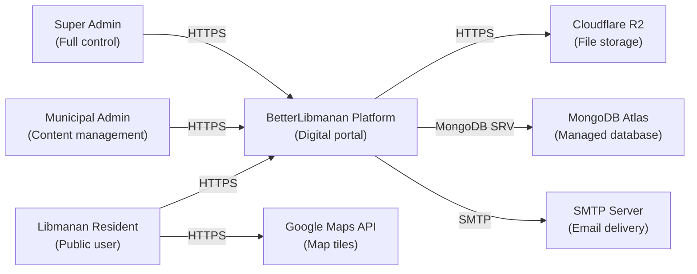
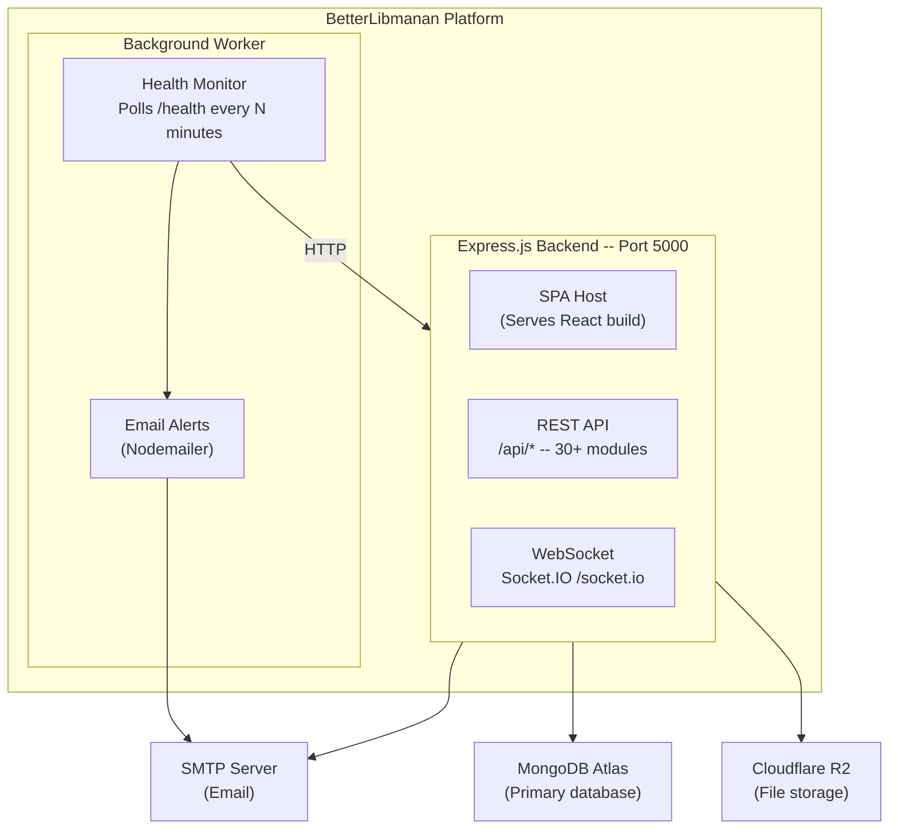
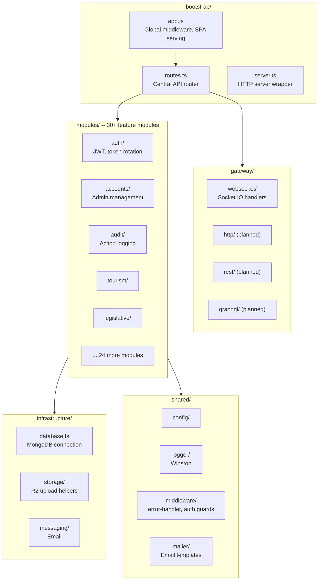
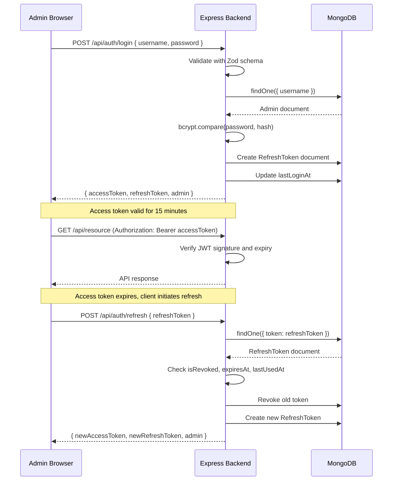
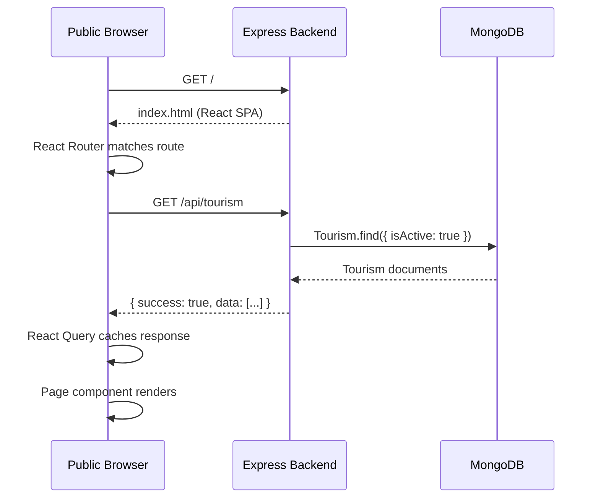
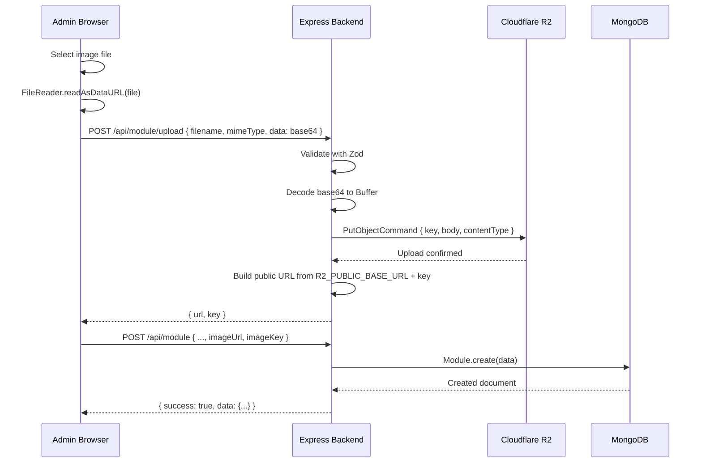
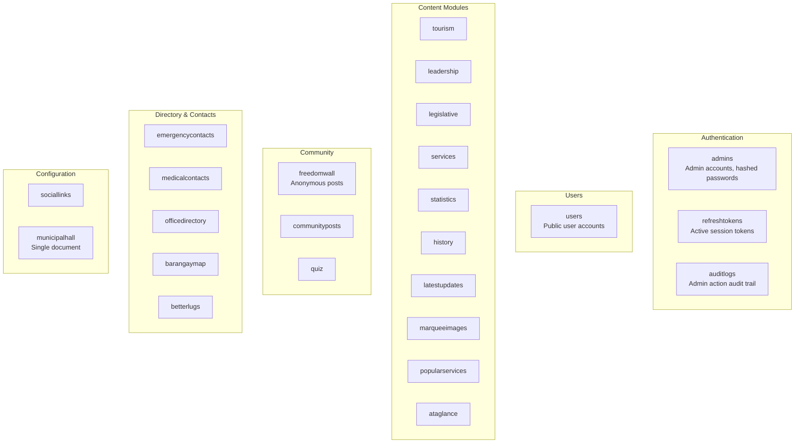
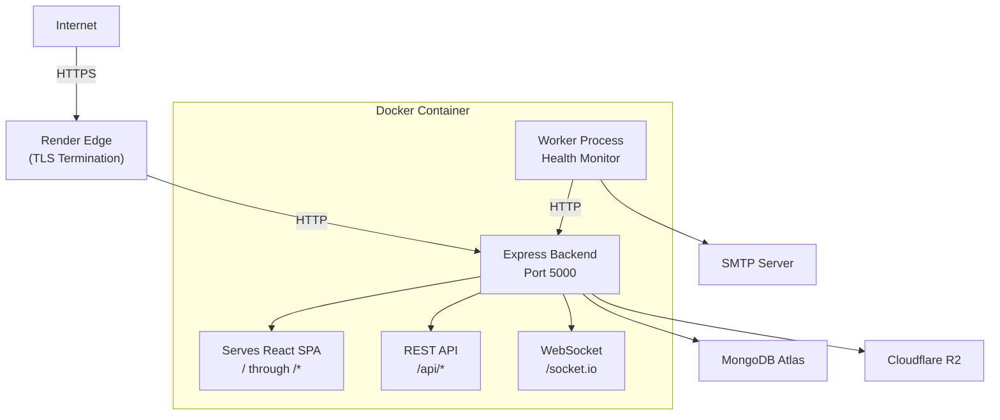
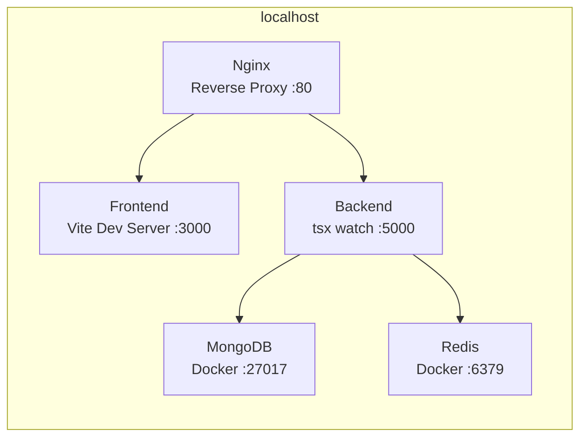

# System Diagrams

Visual representations of BetterLibmanan's architecture, data flows, and component interactions. All diagrams use Mermaid syntax.

## Table of Contents

- [System Context](#system-context)
- [Container Diagram](#container-diagram)
- [Component Diagram -- Backend](#component-diagram--backend)
- [Sequence Diagrams](#sequence-diagrams)
  - [Admin Authentication](#admin-authentication)
  - [Public Data Fetch](#public-data-fetch)
  - [File Upload](#file-upload)
- [Database Collections](#database-collections)
- [Deployment Topology](#deployment-topology)

---

## System Context

Actors and external systems that interact with the platform.

---

## Container Diagram

The major deployable units and their responsibilities.

---

## Component Diagram -- Backend

Internal structure of the backend application.

---

## Sequence Diagrams

### Admin Authentication

---

### Public Data Fetch

---

### File Upload

---

---

## Database Collections

Key collections in the `betterlibmanan` MongoDB database.

---

## Deployment Topology

### Production -- Render.com

### Local Development -- Docker Compose

---

## Rendering Diagrams

- **GitHub**: Mermaid diagrams render natively in Markdown files
- **VS Code**: Install the [Mermaid Preview extension](https://marketplace.visualstudio.com/items?itemName=bierner.markdown-mermaid)
- **Mermaid Live Editor**: [mermaid.live](https://mermaid.live)
